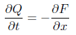
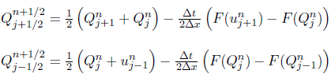
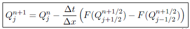
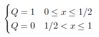
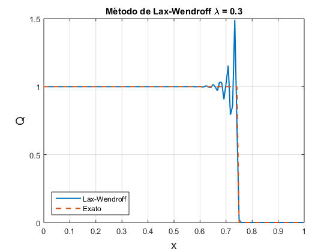
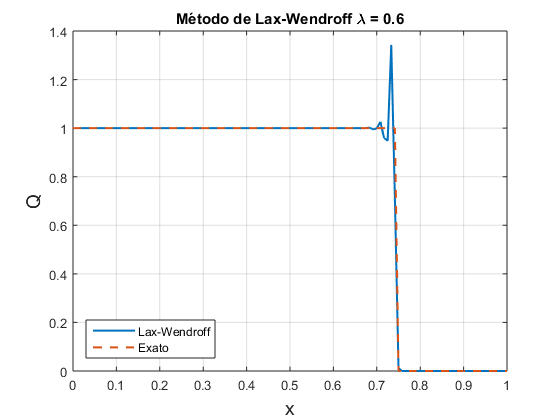
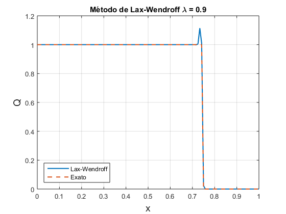
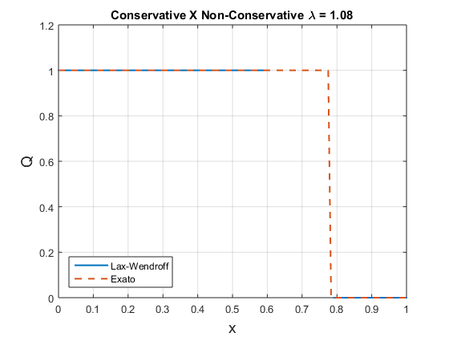

# MetodoLax-Wendroff
Um dos primeiros métodos de diferenças finitas para equações diferenciais parciais hiperbólicas.

O método é um modelo numérico para a resolução de problemas com equações diferenciais parciais hiperbólicas, baseado em diferenças finitas. É um método de segunda ordem no tempo e espaço.

## Lax-Wendroff para sistemas não lineares de EDPs hiperbólicas

Para equação  não linear à obtenção do método de Lax-Wendroff trocando as derivadas temporais por espaciais de *F(Q)* não é direto e único. Uma maneira de fazer isso é utilizando o esquema de dois passos de Lax-Wendroff, qual a forma conservativa  com o fluxo numérico é calculado como segue:

## Lax-Wendroff de dois passos
Em contraste com os demais tipos de métodos numéricos para a solução desse problema, o esquema de dois passos de Lax-Wendroff não pode ser construído por uma escolha de aproximações independente de diferenças finitas no espaço e tempo da equação de advecção linear. Na figura (1) é mostrado o estêncil do método de Lax-Wendroff de 2 passos observe que é necessário passos intermediários durante o calculo.

Estêncil pa o método de Lax-Wendroff de dois passos.

* 1º passo:

Os valores temporários são calculados através de passos intermediários denotados por sinais de quadrados ($\blacksquare$) nos pontos *j\pm 1/2*. Isso é feito usando diferenças adiantadas no espaço e no tempo, tomando as médias aritméticas de *Q_{j+1/2}^{n}* e *u_{j-1/2}^{n}*, nos dois pontos de grade mais próximos de *u_{j}^{n}*. Logo:

 (2)

* 2º passo:

Utilizando os valores intermediários $Q_{j+1/2}^{n+1/2}$ e $Q_{j-1/2}^{n+1/2}$ ,calculados anteriormente, centralizamos a solução no espaço e tempo simultaneamente. Na forma explícita temos:

 (3)

## Exemplo

Resolver a equação discreta \ref{eq:q_conservativo} utilizando o esquema de dois passos de Lax-Wendroff.

Para o domínio espacial
1.0 &le x &le 0,
e o intervalo de tempo
0 &le t &le 0.5
com as seguintes condições iniciais

Com o fluxo não linear *F(Q)=1/2Q^2*.

Após implementarmos o método no \matlab foi simulados a equação de advecção linear para os casos *\lambda = 0,3; 0,6; 0,9; 1,08*. Onde \lambda é o número de Courant-Friedrichs-Lewy.

Solução da equação de advecção pelo método de Lax-Wendroff com *\lambda = 0,3*

Solução da equação de advecção pelo método de Lax-Wendroff com *\lambda = 0,6*

Para o movimento à direita da descontinuidade é corretamente posicionado e definido. A natureza dispersiva do método é evidente através das oscilações próximas da descontinuidade. Apesar do método usar diferenças centradas, alguma assimetria ocorre, uma vez que a onda esta se movendo.

Solução da equação de advecção pelo método de Lax-Wendroff com *\lambda = 0,9*. A medida que $\lambda$ aumenta as oscilações a esquerda do ponto de descontinuidade diminuem.

Solução da equação de advecção pelo método de Lax-Wendroff com *\lambda = 1,08*. Veja que a curva da solução numérica divergiu ao se aproximar do ponto de descontinuidade, ou seja o método de Lax-Wendroff não converge para \lambda > 1.

